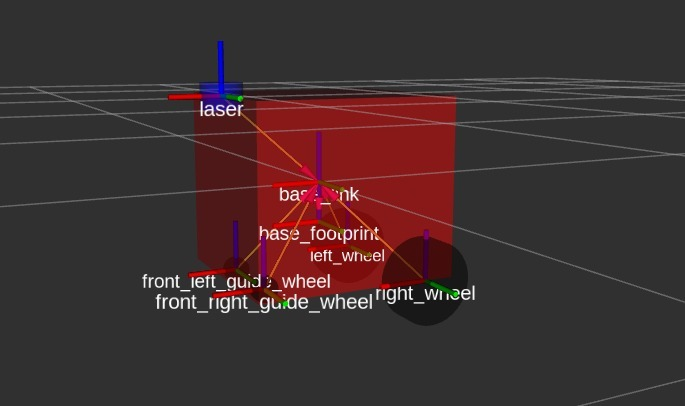

# Hoverboard Driver

This file describes the main functions, configurations, and additional elements included in the `hoverboard-driver` package.

---

## **1. Launch Files (`launch`)**

The following launch files have been added:

### **`map.launch`**
This file runs the Hector Mapping node to generate real-time maps using LiDAR data and the robot's odometry. It also includes configuration to automatically open RViz with relevant topics.

- **Components launched:**
  - **Hector Mapping:** SLAM node to generate maps.
  - **RViz:** Visualization tool to view the map and LiDAR data.
  - **Transformations:** Static publishers to connect `base_link` with the LiDAR.

- **Usage Instructions:**
  Run the file with the following command:
  ```bash
  roslaunch hoverboard_driver map.launch
  ```

  This will open Hector Mapping and RViz automatically.

---

## **2. Required Libraries**

To use this package, make sure the following libraries and dependencies are installed:

### **ROS Dependencies**
- `hector_mapping`: Installation:
  ```bash
  sudo apt-get install ros-noetic-hector-mapping
  ```
- `rviz`: Installation:
  ```bash
  sudo apt-get install ros-noetic-rviz
  ```
- `joint_state_controller`: Installation:
  ```bash
  sudo apt-get install ros-noetic-joint-state-controller
  ```
- `diff_drive_controller`: Installation:
  ```bash
  sudo apt-get install ros-noetic-diff-drive-controller
  ```
- `robot_state_publisher`: Installation:
  ```bash
  sudo apt-get install ros-noetic-robot-state-publisher
  ```

### **Additional Dependencies**
- `xacro`: Installation:
  ```bash
  sudo apt-get install ros-noetic-xacro
  ```

---

## **3. Xacro Model**

The Xacro model defines the robot's physical structure, including:
- Chassis.
- Driving wheels (`left_wheel` and `right_wheel`).
- LiDAR (`laser`).




### **File Location:**
The Xacro model file is located at:
```bash
hoverboard_driver/xacro/robot.urdf.xacro
```

### **Main sections of the model:**

1. **Chassis (`base_link`):**
   - Defines the robot's main base.
   - Includes dimensions and visual material.

2. **Driving wheels (`left_wheel` and `right_wheel`):**
   - Essential for odometry and differential control.
   - Configured as `continuous` joints for continuous rotational movement.

3. **LiDAR (`laser`):**
   - Mounted to the `base_link` frame via a fixed joint.
   - Publishes data on the `/scan` topic.

### **Visualizing in RViz:**
You can visualize the physical model using RViz. Run the following command to load just the model:
```bash
roslaunch hoverboard_driver robot.launch
```

---

## **4. Additional Notes**

- This project has been extended to include mapping functionality with Hector Mapping.
- RViz is automatically configured when running the `map.launch` file.
- Ensure you check the robot's transformations using `rqt_tf_tree`:
  ```bash
  rosrun rqt_tf_tree rqt_tf_tree
  ```

If you encounter any issues or need further assistance, feel free to ask. 😊
